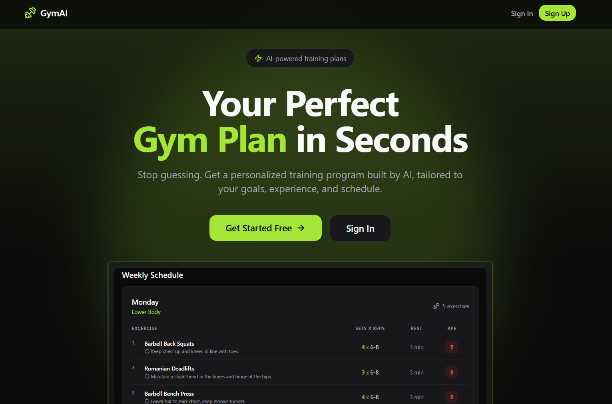
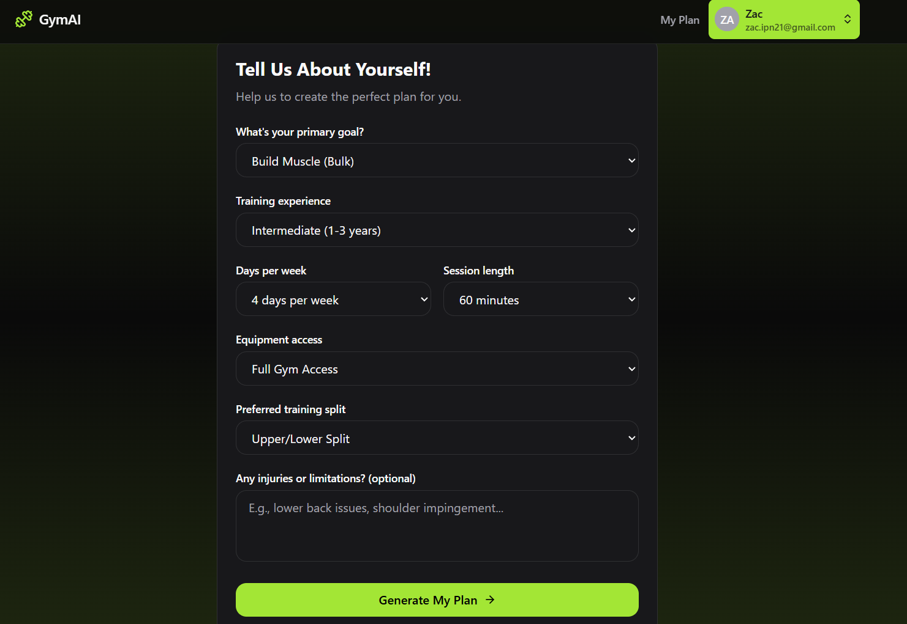
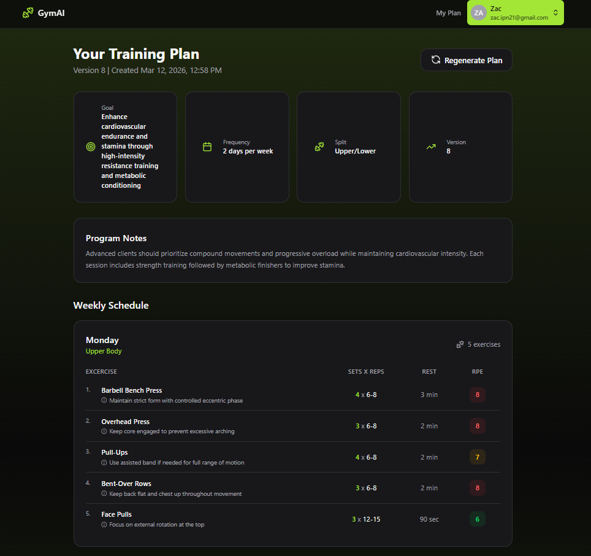

## GymAI Planner

**GymAI Planner** is a full-stack web application that generates personalized gym training programs using AI. The system collects user goals, experience level, and schedule through a questionnaire and produces a tailored workout plan powered by a free AI model.

### Tech Stack

**Frontend**
- React and React Router
- TypeScript
- Vite
- Tailwind CSS
- Lucide React (icons)
- Radix UI (UI primitives)

**Backend**
- Node.js
- Express
- Prisma ORM
- OpenRouter to connect with AI model.

**Database**
- PostgreSQL (Neon serverless)

### Architecture
The backend follows a **REST API architecture** with modular routes.

